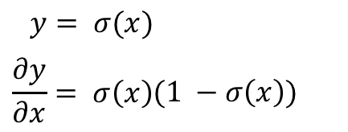

#  How to build a simple artificial neural network
I have written a lot of computer programs in my career, most of the time to solve various problems or perform some tasks (or sometimes just for fun). For most part, other than bugs, as long as I tell the computer what to do very clearly (in whichever the programming language I use) it will obediently follow my instructions.

This is because computer programs are really good at executing algorithms -- instructions that follow defined steps and patterns that are precise and often repetitious. And in most cases they work well for us for tasks like number crunching or repetitious boring work. 


What computer programs are not so good at doing though, are tasks that are not so well defined, and doesn’t follow precise patterns. 


So how can we use computers to do such tasks? Just think about how _you_ do this task. You probably learned about birds when you're young, and you've been told certain animals are birds and certain animals are not, mostly through seeing them either in real life or through picture books. When you get it wrong, you'll be told and you remember that. Over time you have a _mental model_ of what's a bird and what's not. Every time you see something parts of a bird (clawed feet, feathered wings, sharp beak) you don't even need to see the whole animal anymore, you'll automatically identify it correctly by comparing it with your mental model.

So how do we do this with computer programs? Basically we do the same thing. We try to create a _model_ that we can use to compare inputs with, through a trial and error process. And since computer programs are all mathematics, you can guess that it's going to be a _mathematical model_ that we're going to be talking about.

# A guessing game 
Let's take a simple example create a black box that accepts an input and tries to predict the output. 


We feed it with an input and get the output from this predictor. Since we know what the actual output should be, we can tell how different the predicted output is from the actual output. This difference between the actual and the predicted output becomes the _error_. 

Of course, if the predictor is static and can't be changed, it's all pretty much moot. When we feed our predictor with an input, an output is produced with an error and that's the end of the story. Not very useful.

To make our predictor more useful let's give it a configurable parameter  that we can use to influence the output. Since it only predicts correctly if there is no error, we want to change the parameter such that the error shrinks as we keep on feeding the predictor with data. The aim is to get a predictor that predicts the correct output most of the time, without actually needing to give clear instructions to the predictor.

In other words, this is very much like a numbers guessing game.

Let’s see this in a more practical way. Let’s say we have a predictor with the simple mathematical formula `o = i x c` where `o` is the output, `i` is the input and `c` is configurable parameter. 


We are also given a confirmed valid output with a given input, that is, we know if `i` is 10, `o` is 26. How do we find `c` using the predictor?

First, we need take a random prediction, let's say `c` is 2. Let's put in the input 10, and crank up the predictor. The output `o` is 20. Since the error `e = t - o` where `t` is the truth (or target), this means `e = 26 - 20 = 6`. Our error `e` is 6 and we want to achieve 0, so let's try again. 

Let's make `c` to be 3. The output is then `30` and is `e` is now `-4`. Oops, we overshot! Let's go back a bit and make `c` to be 2.5. That makes `o` to be 25, and `e` to be 1. Finally we try `c` to be 2.6 and we get the error `e` to be 0!

Once we know what `c` is, we can use the predictor to predict the output for other inputs. Let's say the input `i` is now 20, then we can predict  `o` to be 52.

As you can see, this method tries to find answers iteratively and improving itself as it goes along, until we get the best fit. This in essence is what [machine learning[([A Beginner’s Guide to AI/ML 🤖👶 – Machine Learning for Humans – Medium](https://medium.com/machine-learning-for-humans/why-machine-learning-matters-6164faf1df12)) is. The computer program  tries to find answers iteratively and ‘learns’ through its mistakes until it achieves a model that can produce the best answer. Once it has the correct model, we can use the model to correctly guess the answers. This is very similar to what we humans do (by learning from past mistakes and correcting ourselves) but how exactly do we do it?

# How humans do it
Let’s step out a bit. We talked a bit about how a machine can possible learn using mathematical functions. How humans do the same thing (as research over the years have shown) is using something called a [_neuron_]([Understanding Neurons’ Role in the Nervous System](https://www.verywellmind.com/what-is-a-neuron-2794890)).


A neuron, or a nerve cell, is a cell that receives information, processes them and transmits through electrical and chemical signals. Our brain and spinal cord (part of what is called our central nervous system) consists of neurons.


A neuron consists of a cell body, dendrites and an axon and can connected to each other to form neural networks. In a neural network, a neuron's axon is connected to the next neuron's dendrites and synaptic signals are transmitted from a neuron through its axon, and received by the next neuron through its dendrites. The connections between the axon and the dendrites is the synapse.


The incoming signals through the dendrite are strengthened or weakened based on how often the synaptic connections are being used and these strengthened or weakened signals are pooled together in the cell body. 

If the pooled signals that are received are strong enough, it will trigger  a new signal that is sent down the line through the axon to other neurons.

As you can see, how a neuron work is somewhat analogous to our predictor earlier. It has a bunch of inputs through its dendrites which it processes and an output through its axon. Instead of a configurable parameter, each input is paired with the strength (or weight) of the synaptic connection.

With this information, let’s get back into our predictor and make some changes.

# Artificial neurons
We start off with building an artificial neuron that emulates the actual biological neuron. This artificial neuron is our upgraded predictor.


Instead of a single input we have a bunch of inputs, each of the modified with a weight (in place of a configurable parameter). These modified inputs are summed up and passed through a triggering or [activation function]([Understanding Activation Functions in Neural Networks](https://medium.com/the-theory-of-everything/understanding-activation-functions-in-neural-networks-9491262884e0)) which determines if an output should be sent.

So why an activation function (beyond the fact that a biological neuron behaves the same way)? There are a few good reasons but one the most important is that activation functions introduce non-linearity into the network. A neural network without activation functions (or a linear activation function) is basically just a [linear regression]([Introduction to Linear Regression](http://onlinestatbook.com/2/regression/intro.html)) model and is not able to do more complicated tasks such as language translations and image classifications. You will see later how non-linear activation functions enable back propagation.

For now, we will assume the use of a common activation function, the [sigmoid function]([Sigmoid function](https://ipfs.io/ipfs/QmXoypizjW3WknFiJnKLwHCnL72vedxjQkDDP1mXWo6uco/wiki/Sigmoid_function.html)).


The interesting thing to note about this function is that the output is always within the range between 0 and 1 but never reaches either. 

# Artificial neural networks
Just like we had neurons forming neural networks, we can also connect our artificial neurons to form artificial neural networks.


It seems quite a bit more complicated now! 

However we’re simply stacking the neurons up in different layers. All the inputs come in through the input layer, which sends its output to the hidden layer, which in turn sends its outputs to the final output layer. While the output from each node is the same (there is only 1 output) but the connections to the neurons in the next layer are weighted differently. For example, the inputs to the first node in the hidden layer would be `(w11 x i1) + (w21 x i2)`.   

# Simplifying with matrices
Calculating the final outputs in this network can be a bit tedious if we have to do it one at a time, especially if we have a lot of neurons. Fortunately there’s an easier way. If we represent the inputs as well as the weights as matrices, we can use the matrix operations to make the calculations easier. In fact we don’t need to do individual neuron input summation and output activation anymore, we simply do it layer by layer.


This will help a lot later in the code, as you will see.

We used the [matrix dot product]([How to Multiply Matrices](https://www.mathsisfun.com/algebra/matrix-multiplying.html)) to handle the multiplication and summation of the input and weights, but for the activation function we will need to apply the sigmoid function to each of the matrix elements. We’ll have to do the same for every hidden layer, and also the output layer.

# Tweaking the weights
You might realise at this point in time, our neural network is (conceptually) simply a larger version of the neuron, and therefore is very much like our predictor earlier. And just like our predictor we want to train our neural network to learn from its mistakes by passing it input with known output.  Then using the difference (error) between the known and actual outputs, we change the weights to minimise the error.

However you’d probably realise that the neural network is quite a bit more complicated than our predictor. First, we have multiple neurons arranged in layers. As a result, while we know the final target output,  we don’t know the intermediate target outputs of the different layers in between. Secondly, we while our predictor is linear, our neurons are passed through a non-linear activation function so the output is not linear. So how do we change the weights of the different connections?


We know from our predictor earlier, we are looking to minimise the final output error `Ek` by changing the various output weights that connect between the hidden layer to the output layer, `wjk`. 

That’s very well and good but how do we minimise a value of a function by changing its input variable?

Let’s look at this from a different perspective. We know the final output error `Ek`  is:


However just subtracting `ok` from `tk` isn’t a great idea because it will often result in negative numbers. If we are trying to find the final output error of the network, we’re actually adding up all the errors, so if some of them are negative numbers it will result in the wrong final output error. A common solution is to use the _squared error_, which the name suggests is:


At the same time we know:


So we know (roughly speaking) if we map `Ek` with `wjk` we will get a range of values (blue line) plotted on a chart (actually this is a multi- dimensional chart but in order to keep our collective sanity, I’m going to use a 2 dimensional chart):  


As you can see, to reach the minimal value of `Ek` we follow the gradient downwards or the negative gradient. In other words, we try to find the negative gradient, change the weight accordingly, then find negative gradient again, until we reach the minimal point of `Ek`. This algorithm is called [_gradient descent_]([An Introduction to Gradient Descent and Linear Regression](https://spin.atomicobject.com/2014/06/24/gradient-descent-linear-regression/)).


You might remember from secondary school calculus, in order to find the gradient of a point in a function we use [differentiation]([Introduction to Derivatives](https://www.mathsisfun.com/calculus/derivatives-introduction.html)) to get the derivative of the function. This allows us to find out how much we need to tweak `wjk`. To find the minimum value of `Ek`, we subtract this amount from `wjk` and we do this repeatedly.

Let’s do the maths. 

In order to calculate the change that we need for the output weights `wjk` we should compute the derivative of the final output error `Ek` with respect to the output weights `wjk`. This means:


That’s neat but how do we get our results using the other variables we have? To do that we need to use the [_chain rule_]([Chain rule - Wikipedia](https://en.wikipedia.org/wiki/Chain_rule)):


That looks slightly better, but we can go even one step further:


 
Let’s get to work. First, we need to find the derivative of `Ek` with respect to the final output `ok`. 

From earlier, we know `Ek` is the squared error:

 

But to differentiate nicely we scale it down by half (I know it’s a bit like cheating but it makes our lives easier):


The derivative of this is:


That’s easy enough! Let’s look at the derivative of the final output `ok` with respect to the summation of the product of the intermediate outputs and the weights, `sumk`. We know the summation is passed through a sigmoid function `sig` in order to get the final output `ok`:


 Therefore the derivative of the final output `ok` with respect to the summation `sumk`is:


This is because we know the derivative of a sigmoid is:



I mentioned earlier above that there are good reasons why we use a sigmoid function — easy differentiation is one of them! The proof of this can be found [here]([How to Compute the Derivative of a Sigmoid Function (fully worked example) - kawahara.ca](http://kawahara.ca/how-to-compute-the-derivative-of-a-sigmoid-function-fully-worked-example/)).  Now since:


we can further simplify the equation to:


Finally we want to find the derivative of the summation `sumk` with respect to the output weight `wjk`.  We know the summation is the sum of the product of the output weight `wjk` and the previous output `oj`:


So the derivative of the summation `sumk` with respect to the output weight `wjk` is:


Now that we have all the 3 derivatives, let’s put them together. Earlier, we said:


Therefore:


With that we have the equation to change the weights for the output layer. What about the weights for the hidden layer(s)? We simply use the same equation but going backwards one layer. This algorithm is called [_back propagation_]([Neural networks and deep learning](http://neuralnetworksanddeeplearning.com/chap2.html)) because it calculates the weights backwards from the final output.

But wait. We don’t have the target output for the hidden layer. So how are we going to get the error for the hidden layer? We have to find another way.

# Backpropagating errors
If you think about it, the error at the output layer is contributed by the errors from the hidden layer according to the connections from the previous hidden layer. In other words, the combination of the errors for the hidden layer forms the errors for the output layer. And since the weights represent the importance of the input, it also represents the contribution of the error.


As as result, we can use the ratio of the weights to calculate the change to make for each weight.  And because the denominator is constant, we can simplify this further by simply drop the denominators.


Now let’s see how we can back propagate the errors from the output layer using matrices. 


Once we have the errors from the hidden layer, we can use the same equation as before, but substituting the final output error with the hidden output error.

# Learning rate
So an artificial neural network learns through back propagation using gradient descent. During gradient descent iterations it’s often easy to overshoot, which results in the moving too quickly and stepping over the minimal `wjk`. To prevent that we use a _learning rate_ `l` to scale down the amount we want to change for the weights.  This results in the change of our earlier equation:


`l` is generally a small value so that we are more cautious about overshooting the minimum but we can’t make it too small either, or else it will take too long to train.  There is quite a bit of research literature on setting the [best learning rate]([Setting the learning rate of your neural network.](https://www.jeremyjordan.me/nn-learning-rate/)).

## Bias
With our current neural network, the activation function is a sigmoid that cuts though `y` at 0.5. Any changes to the weights simply changes the the steepness of the sigmoid. As a result there is a limitation to how the neuron is being triggered. For example, to make the sigmoid return a low value of 0.1 when `x` is 2 is going to be impossible.  


However if we add a [_bias_]([Make Your Own Neural Network: Bias Nodes in Neural Networks](http://makeyourownneuralnetwork.blogspot.sg/2016/06/bias-nodes-in-neural-networks.html)) value to `x` this changes things altogether.


How we do this is by adding something called a _bias neuron_ to the neural network. This bias neuron always outputs 1.0 and is added to a layer but doesn’t have any have any input. 


Not all neural networks need bias neurons. In the simple neural network we’re going to write later, we’ll not be using any bias neurons (and it works pretty ok). 

# Finally some code!
So we’re finally here! After all the concepts and maths, we’re now going to start some implementation! 

All the code here can be found in this Github repository:

http://sausheong.github.com/sausheong/gonn

At this point in time Go doesn’t have a lot of support in terms of libraries for machine learning, unlike Python. However there is a very useful library called [Gonum]([Gonum](https://www.gonum.org/)) that provides what we need most — matrix manipulation.

Also, while Gonum has perfectly fine packages, I thought some of the quirks in Gonum makes it unnecessarily verbose so I created my own helper functions to overcome it.

## Matrix helpers
We’ll start with the helper functions first. Gonum’s main package for matrix manipulation is called `mat`. What we’ll be using are primarily going to be the `mat.Matrix` interface and its implementation `mat.Dense`. 
 
The `mat` package has a quirk that it requires us to create a new matrix with the exact correct rows and columns first, before we can execute the operations on the matrices. Doing so for multiple operations would be rather annoying so I wrapped around each function with my own.

For example, the Gonum `Product` function allows us to perform the dot product operation on two matrices, and I created a helper function that finds out the size of the matrix, creates it and perform the operation before returning the resultant matrix. 

This helps to save around 1-3 lines of code or so, depending on the operation.

```go
func dot(m, n mat.Matrix) mat.Matrix {
	r, _ := m.Dims()
	_, c := n.Dims()
	o := mat.NewDense(r, c, nil)
	o.Product(m, n)
	return o
}
```

The `apply` function allows us to apply a function to the matrix.

```go
func apply(fn func(i, j int, v float64) float64, m mat.Matrix) mat.Matrix {
	r, c := m.Dims()
	o := mat.NewDense(r, c, nil)
	o.Apply(fn, m)
	return o
}
```

The `scale` function allows us to scale a matrix i.e. multiply a matrix by a scalar.

```go
func scale(s float64, m mat.Matrix) mat.Matrix {
	r, c := m.Dims()
	o := mat.NewDense(r, c, nil)
	o.Scale(s, m)
	return o
}
```

The `multiply` function multiplies 2 functions together (this is different from dot product`.

```go
func multiply(m, n mat.Matrix) mat.Matrix {
	r, c := m.Dims()
	o := mat.NewDense(r, c, nil)
	o.MulElem(m, n)
	return o
}
```

The `add` and `subtract` functions allow to add or subtract a function to/from another.

```go
func add(m, n mat.Matrix) mat.Matrix {
	r, c := m.Dims()
	o := mat.NewDense(r, c, nil)
	o.Add(m, n)
	return o
}

func subtract(m, n mat.Matrix) mat.Matrix {
	r, c := m.Dims()
	o := mat.NewDense(r, c, nil)
	o.Sub(m, n)
	return o
}
```

Finally the `addScalar` function allows us to add a scalar value to each element in the matrix.

```go
func addScalar(i float64, m mat.Matrix) mat.Matrix {
	r, c := m.Dims()
	a := make([]float64, r*c)
	for x := 0; x < r*c; x++ {
		a[x] = i
	}
	n := mat.NewDense(r, c, a)
	return add(m, n)
}
```

## The neural network
Here we go!

We’ll be creating a very simple 3 layer feedforward neural network.  We start off with defining the network:

```go
type Network struct {
	inputs        int
	hiddens       int
	outputs       int
	hiddenWeights *mat.Dense
	outputWeights *mat.Dense
	learningRate  float64
}
```

 The fields `inputs`, `hiddens` and `output` define the number of neurons in each of the input, hidden and output layers (remember, this is a 3 layer network). The `hiddenWeights` and `outputWeights` fields are matrices that represent the weights from the input to hidden layers, and the hidden to output layers respectively. Finally, the learningRate is, well, the learning rate for the network.

Next we have a simple method to actually create the neural network.

```go
func CreateNetwork(input, hidden, output int, rate float64) (net Network) {
	net = Network{
		inputs:       input,
		hiddens:      hidden,
		outputs:      output,
		learningRate: rate,
	}
	net.hiddenWeights = mat.NewDense(net.hiddens, net.inputs, randomArray(net.inputs*net.hiddens, float64(net.inputs)))
	
	net.outputWeights = mat.NewDense(net.outputs, net.hiddens, randomArray(net.hiddens*net.outputs, float64(net.hiddens)))
	return
}
```

The number of input, hidden and output neurons as well as the learning rate is passed in from the caller to create the network. However the hidden and output weights are randomly created.

If you remember from above, the weights we are creating is a matrix with the number of columns represented by _from_ layer, and the number of rows represented by the _to_ layer. This is because the number of rows in the weight must the same as the number of neurons in the _to_ layer and the number of columns must be the same number of neurons as the _from_ layer (in order to multiply with the outputs of the _from_ layer). Take a while to look at the diagrams below again — it will make more sense.


Initializing the weights with a random set of numbers is one of the important parameters. For this we’re going to use a function `randomArray` to create this random array of float64. 

```go
func randomArray(size int, v float64) (data []float64) {
	dist := distuv.Uniform{
		Min: -1 / math.Sqrt(v),
		Max: 1 / math.Sqrt(v),
	}

	data = make([]float64, size)
	for i := 0; i < size; i++ {
		data[i] = dist.Rand()
	}
	return
}
```

The `randomArray` function uses the `distuv` package in Gonum to create a uniformly distributed set of values between the range of `-1/sqrt(v)` and `1/sqrt(v)` where `v` is the size of the _from_ layer. This is quite a commonly used distribution.

Now that we have our neural network, the two main functions we can ask it to do is to either train itself with a set of training data, or predict values given a set of test data.

From our hard work earlier on, we know that prediction means forward propagation through the network while training means forward propagation first, then back propagation later on to change the weights using some training data.

Since both training and prediction requires forward propagation, let’s start with that first. We define a function called `Predict` to predict the values using the trained neural network.

```go
func (net Network) Predict(inputData []float64) mat.Matrix {
	// forward propagation
	inputs := mat.NewDense(len(inputData), 1, inputData)
	hiddenInputs := dot(net.hiddenWeights, inputs)
	hiddenOutputs := apply(sigmoid, hiddenInputs)
	finalInputs := dot(net.outputWeights, hiddenOutputs)
	finalOutputs := apply(sigmoid, finalInputs)
	return finalOutputs
}
```

We start off with the inputs first, by creating a matrix called `inputs` to represent the input values. Next we find the inputs to hidden layer by applying the dot product between the hidden weights and the inputs, creating a matrix called `hiddenInputs`. In other words, given a 2 neuron input layer and a 3 neuron hidden layer, this is what we get:


Next, we apply our activation function, `sigmoid`  on the hidden inputs to produce `hiddenOutputs`.

```go
func sigmoid(r, c int, z float64) float64 {
	return 1.0 / (1 + math.Exp(-1*z))
}
```

We repeat these 2 actions for final inputs and final outputs to produce `finalInputs` and `finalOutputs` respectively and the prediction is the final outputs.

So that’s how we predict using the forward propagation algorithm. Let’s see how we do forward and back propagation in training.

```go
func (net *Network) Train(inputData []float64, targetData []float64) {
	// forward propagation
	inputs := mat.NewDense(len(inputData), 1, inputData)
	hiddenInputs := dot(net.hiddenWeights, inputs)
	hiddenOutputs := apply(sigmoid, hiddenInputs)
	finalInputs := dot(net.outputWeights, hiddenOutputs)
	finalOutputs := apply(sigmoid, finalInputs)

	// find errors
	targets := mat.NewDense(len(targetData), 1, targetData)
	outputErrors := subtract(targets, finalOutputs)
	hiddenErrors := dot(net.outputWeights.T(), outputErrors)

	// backpropagate
	net.outputWeights = add(net.outputWeights,
		scale(net.learningRate,
			dot(multiply(outputErrors, sigmoidPrime(finalOutputs)),
				hiddenOutputs.T()))).(*mat.Dense)
	
	net.hiddenWeights = add(net.hiddenWeights,
		scale(net.learningRate,
			dot(multiply(hiddenErrors, sigmoidPrime(hiddenOutputs)),
				inputs.T()))).(*mat.Dense)
}
```

The forward propagation part is exactly the same as in the `Predict` function. We are not calling `Predict` here though because we still need the other intermediary values.

The first thing we need to do after getting the final outputs is to determine the output errors. This is relatively simple, we simply subtract our target data from the final outputs to get `outputErrors`:


The hidden errors from the hidden layer is a bit trickier. Remember this?


We use back propagation to calculate the hidden errors by applying the dot product on the transpose of the output weights and the output errors. This will give us `hiddenErrors`.

Now that we have the errors, we simply use the formula we derived earlier (including the learning rate) for changes to the weights we need to do:


Remember that we are subtracting this number from the weights. Since this is a negative number, we end up adding this to the weights, which is what we did.

To simplify the calculations we use a `sigmoidPrime` function, which is nothing more than doing `sigP = sig(1 - sig)`:

```go
func sigmoidPrime(m mat.Matrix) mat.Matrix {
	rows, _ := m.Dims()
	o := make([]float64, rows)
	for i := range o {
		o[i] = 1
	}
	ones := mat.NewDense(rows, 1, o)
	return multiply(m, subtract(ones, m)) // m * (1 - m)
}
```

Also you might see that we’re doing the dot product of the transpose of the previous output — this is because we’re multiplying across layers.

Finally we do this twice to get the new hidden and output weights for our neural network.

And that’s a wrap for the `Train` function. 

## Saving the training results
Before we move on to using the neural network, we’ll see how we can save our training results and load it up for use later. We certainly don’t want to train from scratch each time we want to do the prediction — training the network can often take quite a while.

```go
func save(net Network) {
	h, err := os.Create("data/hweights.model")
	defer h.Close()
	if err == nil {
		net.hiddenWeights.MarshalBinaryTo(h)
	}
	o, err := os.Create("data/oweights.model")
	defer o.Close()
	if err == nil {
		net.outputWeights.MarshalBinaryTo(o)
	}
}

// load a neural network from file
func load(net *Network) {
	h, err := os.Open("data/hweights.model")
	defer h.Close()
	if err == nil {
		net.hiddenWeights.Reset()
		net.hiddenWeights.UnmarshalBinaryFrom(h)
	}
	o, err := os.Open("data/oweights.model")
	defer o.Close()
	if err == nil {
		net.outputWeights.Reset()
		net.outputWeights.UnmarshalBinaryFrom(o)
	}
	return
}
```

The `save` and `load` functions are mirror images of each other and we use a convenient function from the Gonum `mat` package to marshal the weight matrices into binary form and unmarshal the same form back to matrices. This is pretty mundane — the only thing of note is that when we unmarshal from the binary data back to the weight matrices, we need to first reset the matrices back to zero-value so that it can be reused. 

# Using our neural network
We’re finally here — using the neural network! 

## MNIST handwriting recognition
Let’s start with a ‘hello world’ of machine learning — using the MNIST dataset  to recognise handwritten numeric digits. The MNIST dataset is a set of 60,000 scanned handwritten digit images used for training and 10,000 similar images used for testing. It’s a subset of a larger set from NIST (National Institute of Standards and Technology)  that has been size-normalised and centered. The images are in black and white and are 28 x 28 pixels. The original dataset are stored in a format is that more difficult to work with, so people have come up with [simpler CSV formatted datasets]([MNIST in CSV](https://pjreddie.com/projects/mnist-in-csv/)), which is what we’re using.


In the CSV format every line is an image, and each column except the first represents a pixel. The first column is the label, which is the actual digit that the image is supposed to represent. In other words, this is the target output. Since there are 28 x 28 pixels, this means there are 785 columns in every row.

Let’s start with the training. We create a function called `mnistTrain` that takes in a neural network and use it for training the MNIST dataset:

```go
func mnistTrain(net *Network) {
	rand.Seed(time.Now().UTC().UnixNano())
	t1 := time.Now()

	for epochs := 0; epochs < 5; epochs++ {
		testFile, _ := os.Open("mnist_dataset/mnist_train.csv")
		r := csv.NewReader(bufio.NewReader(testFile))
		for {
			record, err := r.Read()
			if err == io.EOF {
				break
			}

			inputs := make([]float64, net.inputs)
			for i := range inputs {
				x, _ := strconv.ParseFloat(record[i], 64)
				inputs[i] = (x / 255.0 * 0.99) + 0.01
			}

			targets := make([]float64, 10)
			for i := range targets {
				targets[i] = 0.1
			}
			x, _ := strconv.Atoi(record[0])
			targets[x] = 0.9

			net.Train(inputs, targets)
		}
		testFile.Close()
	}
	elapsed := time.Since(t1)
	fmt.Printf("\nTime taken to train: %s\n", elapsed)
}
```

We open up the CSV file and read each record, then process each record. For every record we read in we create an array that represents the inputs and an array that represents the targets. 

For the `inputs` array we take each pixel from the record, and convert it to a value between 0.0 and 1.0 with 0.0 meaning a pixel with no value and 1.0 meaning a full pixel. 

For the `targets` array, each element of the array represents the probability of the index being the target digit. For example, if the target digit is 3, then the 4th element `targets[3]` would have a probability of 0.9 while the rest would have a probability of 0.1. 

Once we have the inputs and targets, we call the `Train` function of the network and pass it the inputs and targets.

You might notice that we ran this in ‘epochs’. Basically what we did was to run this multiple times because the more times we run through the training the better trained the neural network will be. However if we over-train it, the network will _overfit_, meaning it will adapt too well with the training data and will ultimately perform badly with data that it hasn’t seen before.

Predicting the hand-written images is basically the same thing, except that we call the `Predict` function with only the inputs.

```go
func mnistPredict(net *Network) {
	t1 := time.Now()
	checkFile, _ := os.Open("mnist_dataset/mnist_test.csv")
	defer checkFile.Close()

	score := 0
	r := csv.NewReader(bufio.NewReader(checkFile))
	for {
		record, err := r.Read()
		if err == io.EOF {
			break
		}
		inputs := make([]float64, net.inputs)
		for i := range inputs {
			if i == 0 {
				inputs[i] = 1.0
			}
			x, _ := strconv.ParseFloat(record[i], 64)
			inputs[i] = (x / 255.0 * 0.99) + 0.01
		}
		outputs := net.Predict(inputs)
		best := 0
		highest := 0.0
		for i := 0; i < net.outputs; i++ {
			if outputs.At(i, 0) > highest {
				best = i
				highest = outputs.At(i, 0)
			}
		}
		target, _ := strconv.Atoi(record[0])
		if best == target {
			score++
		}
	}

	elapsed := time.Since(t1)
	fmt.Printf("Time taken to check: %s\n", elapsed)
	fmt.Println("score:", score)
}
```

The results that we get is an array of probabilities. We figure out the element with the highest probability and the digit should be the index of that element. If it is, we count that as a win. The final count of the wins is our final score.

Because we have 10,000 test images, if we manage to detect all of them accurately then we have will 100% accuracy. Let’s look at the `main` function:

```go
func main() {
	// 784 inputs - 28 x 28 pixels, each pixel is an input
	// 200 hidden neurons - an arbitrary number
	// 10 outputs - digits 0 to 9
	// 0.1 is the learning rate
	net := CreateNetwork(784, 200, 10, 0.1)

	mnist := flag.String("mnist", "", "Either train or predict to evaluate neural network")
	flag.Parse()

	// train or mass predict to determine the effectiveness of the trained network
	switch *mnist {
	case "train":
		mnistTrain(&net)
		save(net)
	case "predict":
		load(&net)
		mnistPredict(&net)
	default:
		// don't do anything
	}
}
```

This is pretty straightforward, we first create a neural network with 784 neurons in the input layer (each pixel is one input), 200 neurons in the hidden layer and 10 neurons in the output layer, one for each digit.

Then we train the network with the MNIST training dataset, and the predict the images with the testing dataset. This is what I have when I test it:


It took 8 mins to train the network with 60,000 images and 5 epochs, and 4.4 secs to test it with 10,000 images. The result is 9,772 images were predicted correctly, which is 97.72% accuracy! 

## Predicting individual files
Now that we have tested our network, let’s see how to use it on individual images. 

First we get the data from the PNG file. To do this, we create a `dataFromImage` function.

```go
func dataFromImage(filePath string) (pixels []float64) {
	// read the file
	imgFile, err := os.Open(filePath)
	defer imgFile.Close()
	if err != nil {
		fmt.Println("Cannot read file:", err)
	}
	img, err := png.Decode(imgFile)
	if err != nil {
		fmt.Println("Cannot decode file:", err)
	}

	// create a grayscale image
	bounds := img.Bounds()
	gray := image.NewGray(bounds)

	for x := 0; x < bounds.Max.X; x++ {
		for y := 0; y < bounds.Max.Y; y++ {
			var rgba = img.At(x, y)
			gray.Set(x, y, rgba)
		}
	}
	// make a pixel array
	pixels = make([]float64, len(gray.Pix))
	// populate the pixel array subtract Pix from 255 because 
	// that's how the MNIST database was trained (in reverse)
	for i := 0; i < len(gray.Pix); i++ {
		pixels[i] = (float64(255-gray.Pix[i]) / 255.0 * 0.99) + 0.01
	}
	return
}
```

Each pixel in the image represents an value but we can’t use the normal RGBA, instead we need an `image.Gray` . From the `image.Gray` struct we get the `Pix` value and translate it into a `float64` value instead. The MNIST image is white on black, so we need to subtract each pixel value from 255.

Once we have the pixel array, it’s quite straightforward. We use a `predictFromImage` function that takes in the neural network and predicts the digit from an image file. The results are an array of probabilities where the index is the digit. What we need to do is to find the index and return it.

```go
func predictFromImage(net Network, path string) int {
	input := dataFromImage(path)
	output := net.Predict(input)
	matrixPrint(output)
	best := 0
	highest := 0.0
	for i := 0; i < net.outputs; i++ {
		if output.At(i, 0) > highest {
			best = i
			highest = output.At(i, 0)
		}
	}
	return best
}
```

Finally from the `main` function we print the image and predict the digit from the image.

```go
func main() {
	// 784 inputs - 28 x 28 pixels, each pixel is an input
	// 100 hidden nodes - an arbitrary number
	// 10 outputs - digits 0 to 9
	// 0.1 is the learning rate
	net := CreateNetwork(784, 200, 10, 0.1)

	mnist := flag.String("mnist", "", "Either train or predict to evaluate neural network")
	file := flag.String("file", "", "File name of 28 x 28 PNG file to evaluate")
	flag.Parse()

	// train or mass predict to determine the effectiveness of the trained network
	switch *mnist {
	case "train":
		mnistTrain(&net)
		save(net)
	case "predict":
		load(&net)
		mnistPredict(&net)
	default:
		// don't do anything
	}

	// predict individual digit images
	if *file != "" {
		// print the image out nicely on the terminal
		printImage(getImage(*file))
		// load the neural network from file
		load(&net)
		// predict which number it is
		fmt.Println("prediction:", predictFromImage(net, *file))
	}
}
```

Assuming the network has already been trained, this is what we get.


And that’s it, we have written a simple 3-layer feedforward neural network from scratch using Go!

# References
Here are some of the references for I took when writing this post and the code.

* Tariq Rashid’s [Make Your Own Neural Network]([Make Your Own Neural Network 1.0, Tariq Rashid, eBook - Amazon.com](https://www.amazon.com/Make-Your-Own-Neural-Network-ebook/dp/B01EER4Z4G)) is a great book to learn the basics of neural networks with its easy style of explanation
* Michael Nielsen’s [Neural Networks and Deep Learning] ([Neural networks and deep learning](http://neuralnetworksanddeeplearning.com/)) free online book is another amazing resource to learn the intricacies of building neural networks
* Daniel Whitenack wrote a book on _Machine Learning With Go_ and his post on [Building a Neural Net from Scratch in Go]([Building a Neural Net from Scratch in Go](http://www.datadan.io/building-a-neural-net-from-scratch-in-go/)) is quite educational
* Ujjwal Karn’s data science blog has a nice [introductory post on neural networks]([A Quick Introduction to Neural Networks – the data science blog](https://ujjwalkarn.me/2016/08/09/quick-intro-neural-networks/))
